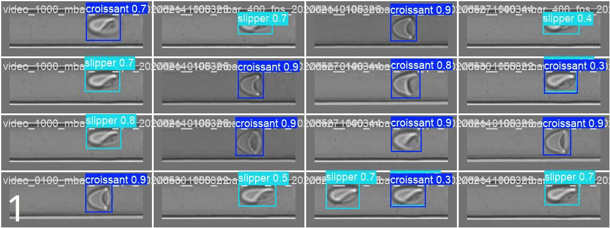
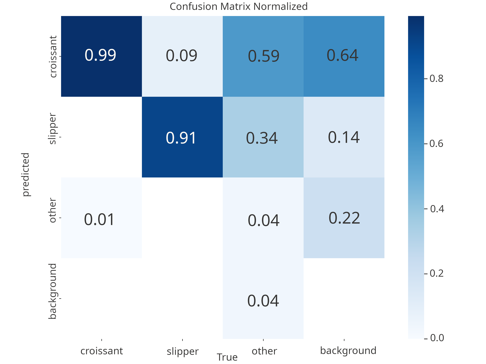
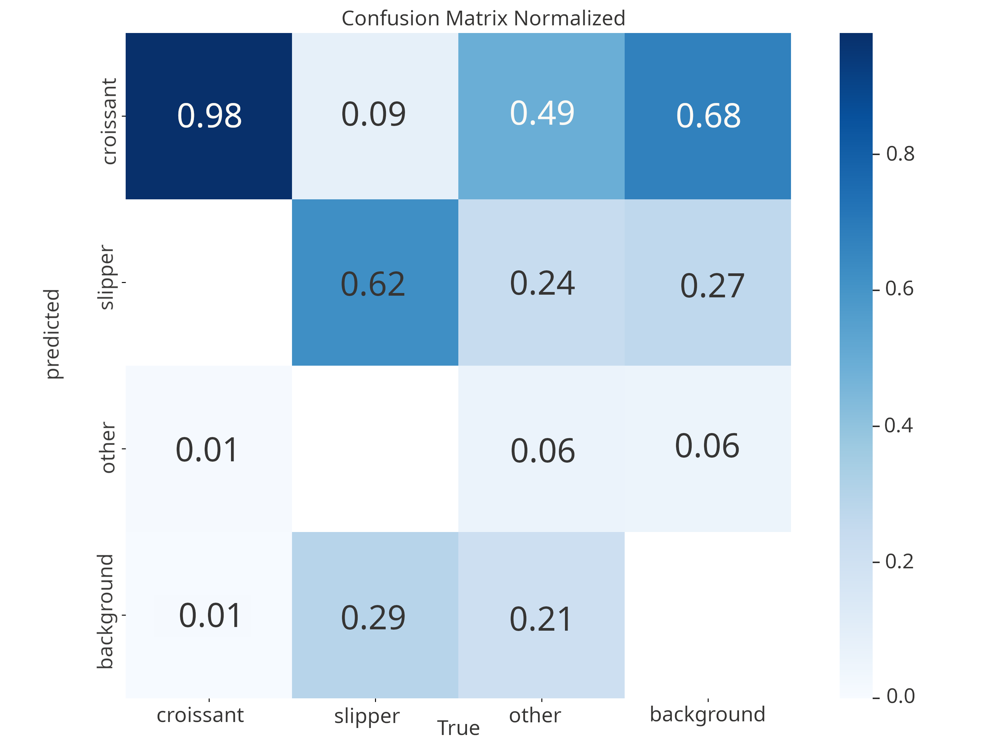
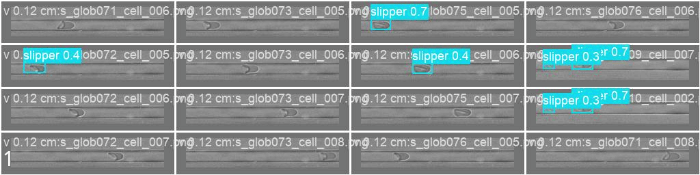

# Detection and Classification of Red Blood Cells under flow

This study conducted a comprehensive investigation into the detection and classification of red blood cell morphologies, in particular of “slipper” and “parachute” shapes under flow conditions, exploiting the YOLOv11 framework.
A significant part of this work focused on addressing the challenge of data sparsity and bias between datasets through the strategic construction of different datasets.

To counter the prevailing problem of data sparsity and improve the generalisation of the model, the study ventures
into the generation of multiple-cell datasets through a cut-and-paste augmentation technique

# 🔨 Setup

```bash
python -m venv venv
source venv/bin/activate
pip install -r requirements.txt
```

See the Saved Weights section for using the weights. The network used is [yolo11s](https://docs.ultralytics.com/fr/models/yolo11/#key-features).

# Results

The performance of YOLOv11 is evaluated both on the Saarland University dataset, where the focus is
on accurate cell type classification, and on the Naples University dataset, which is primarily aimed at differentiation
between cells and background. 
On the Saarland University dataset, the model shows excellent performance for the
distinct class “parachute”, consistently achieving high recall.
When compared to the Naples dataset, characterised by significant colour shifts in the image,
the YOLO model shows significant difficulties.
It consistently produces high false negative rates, failing to detect a large percentage of real cells and showing high false-positive rates due to misinterpretation of the background.

Overall, these results demonstrate that YOLOv11, despite its strong performance within training-data-like environments, 
exhibits significant limitations in its generalization capabilities when confronted with substantial discrepancies
in visual characteristics. This underscores the inherent challenge in constructing a single, comprehensive dataset
capable of encompassing the vast array of diverse scenarios encountered in the microscopy domain

> 
> 
> Evaluation on Saarland University videos. The model was trained with randomly placed cells, no overlap and three classes (croissants, slippers, others). The model manages to detect cells and classify them properly. The confusion matrix of this model is the second below (B).

---

> 
> 
> A) Confusion matrix normalized on the videos provided by the Saarland University (Germany). The model was trained with randomly placed cells, overlaps allowed, with three classes. While this confusion matrix is better than the one without the overlaps (B), the predicted bounding boxes are more misaligned.

---

> 
> 
> B) Confusion matrix normalized on the videos provided by the Saarland University (Germany). The model was trained with randomly placed cells, with three classes. Cells were not overlapping in the training data.

---

> 
>
> Evaluation on Naples University data. The provided images have vastly different characteristics compared to training data: the cells are more elongated, the image color range is different and the color expression is different as well (cells do not have a white halo-border). A model trained on the same data as before struggles to detect these cells. Future works should create ground truth labels for this data and incorporate these images in the training data.

Saved evaluation results are available under `runs/detect/`: they are the folders beginning with `val`. See last part of this readme for naming conventions.


# Saved weights

A set of weights are available under the `runs/detect/` folder.

| Folder Name | Model type                                                                                                            |
|-------------|-----------------------------------------------------------------------------------------------------------------------|
| train13     | Model trained with randomly positionned cells, overlaps allowed. Trained on 3 classes : croissants, slippers, others. |
| train16     | Model trained with randomly positionned cells, no overlap, on 3 classes                                               |
| train18     | Model trained with randomly positionned cells, no overlap, 2 classes (croissants, slippers)                           |
| train15     | Model trained on a microfluidic device like background, no overlap, 3 classes                                         |

# File Structure

Scripts under the `scripts/` folder:

| Filename pattern      | File role                                                                                                         |
|-----------------------|-------------------------------------------------------------------------------------------------------------------|
| `cellpose.py`         | Helper functions to segment images using [CellPose](https://www.biorxiv.org/content/10.1101/2025.04.28.651001v1). |
| `data_creation....py` | Scripts used to create the dataset.                                                                               |
| `metadata.py`         | Helper functions to handle a csv file representing the constructed dataset.                                       |
| `tSNE...py`           | Scripts that use the feature vector of a pretrained ResNet to visualize differences in image characteristics.     |
| `training.py`         | Train the model on a dataset                                                                                      |
| `testing.py`          | Evaluate the model and produce confusion matrices                                                                 |

Notebooks under the `notebooks/` folder:

| Filename pattern                      | File role                                                                                       |
|---------------------------------------|-------------------------------------------------------------------------------------------------|
| `analysis_of_dataset_csv_files.ipynb` | Analyse characteristics of constructed dataset.                                                 |
| `data_analyse_videos.ipynb`           | Analyse videos shared from universities to segment individual cells and infer label.            |
| `data_cellpos....ipynb`               | Use `Cellpose` to extract individual cells from source dataset.                                 |
| `data_creation....ipynb`              | Differente ways to construct the dataset (from manual annotation, from cellpose's outputs, ...). |
| `data_naples_extraction.ipynb`        | Find and segment cells from the Naples University.                                               |
| `data_synthetic_data_creation.ipynb`  | Constructed a dataset with synthetically generated cells                                         |
| `test_synthetic_test.ipynb`           | Test a model on detection-classification tasks, trained on a synthetic dataset.                  |
| `datasets_exploration.ipynb`          | Exploration of the images provided by different universities.                                    |
| `german_cell_selection_UNET.ipynb`    | Attempt to create well-centered cell images from Germany University using UNet.                   |
| `singapore_cell_selection_UNET.ipynb` | Creation of well-centered cell images from Singapore University using UNet.                      |
| `singapore_cell_selection_YOLO.ipynb` | Attempt to create well-centered cell images from Singapore University using YOLO.                 |

# Naming conventions 

- `random`: model trained on randomly placed cells
- `microfluidic`: model trained on a microfluidic device like background
- `nosuperposition`: cells are not overlapping in the training dataset
- `noother`: the model was trained on 2 classes, croissants and slippers
- `on_naples`: model tested on the Naples University dataset
- `on_cropped_labelled_video_frames`: model tested on the Saarland University videos (data from only one donor was used)
- `on_cropped_labelled_donors_video_frames`: model tested on the Saarland University videos (data from all donors was used)

# Acknowledgement

The authors would like to thank Prof. Giovanna Tomaiuolo and Prof. Stefano Guido of the Università degli Studi di Napoli Federico II; Prof. Christian Wagner, Prof. Lars Kästner, and Dr. Mohammed Nouaman of the Universität des Saarlandes; and Prof. Ye Ai of the Singapore University of Technology and Design for kindly sharing their datasets and granting permission for their use. 

Professors C. Wagner and Y. Ai notably granted us access to the data of the following publications:

-  A. Kihm, L. Kaestner, C. Wagner, and S. Quint, Classification of red blood cell shapes in flow using outlier tolerant
machine learning, PLoS Computational Biology, vol. 14, no. 6, p. e1006278, 2018. doi:10.1371/journal.pcbi.1006278.

- M. Liang, J. Zhong, C. S. Shannon, R. Agrawal, and Y. Ai, Intelligent image-based deformability assessment of red blood cells via dynamic shape classification, Sensors and Actuators B: Chemical, vol. 401, p. 135056, 2024. doi:10.1016/j.snb.2023.135056

The authors also wish to thank Dr. Imad Rida, Ms. Alaa Bou Orm, and Prof. Amine Nait-Ali for their valuable support and for providing the opportunity to present this work at BioSMART—the 6th International Conference on Bioengineering for Smart Technologies.

# Citation
```
@article {Amrani2025.09.18.677048,
	author = {Amrani, A. and Caridi, I. and Kaoui, B.},
	title = {Deep Learning Detection and Classification of Red Blood Cells: Towards a Universal Dataset},
	elocation-id = {2025.09.18.677048},
	year = {2025},
	doi = {10.1101/2025.09.18.677048},
	publisher = {Cold Spring Harbor Laboratory},
	abstract = {We evaluate emerging machine learning models for pattern recognition, focusing on the YOLOv11 architecture for detecting and classifying red blood cell shapes. Our analysis targets two characteristic morphologies observed under flow: slipper and parachute. A key challenge in this task is the development of a robust and diverse dataset. To address this, we employ synthetic image generation using a cut-and-paste approach, introducing variations in cell overlap and arrangements of microfluidic channels disposition to alleviate data scarcity and reduce cross-dataset bias. We generate these datasets with U-Net and Cellpose segmentation models, and rigorously assess YOLOv11 performance on two benchmarks: (i) a controlled dataset for evaluating classification accuracy, and (ii) a challenging, visually heterogeneous dataset for assessing generalization. Results show that the model achieves high precision for distinct cell types in controlled settings, but exhibits reduced performance on the unseen dataset, highlighting a trade-off between specialized accuracy and broad applicability in complex microscopy scenarios.Competing Interest StatementThe authors have declared no competing interest.},
	URL = {https://www.biorxiv.org/content/early/2025/09/20/2025.09.18.677048},
	eprint = {https://www.biorxiv.org/content/early/2025/09/20/2025.09.18.677048.full.pdf},
	journal = {bioRxiv}
}
```
